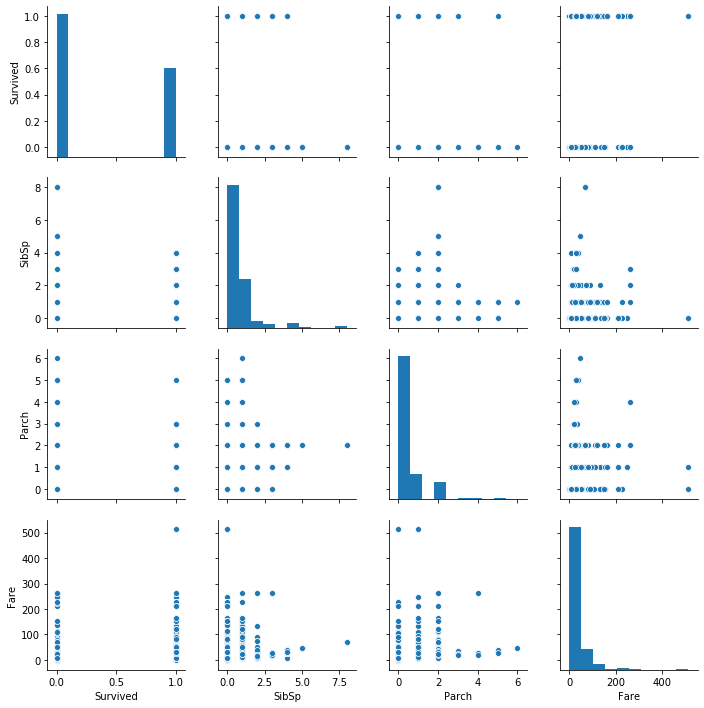
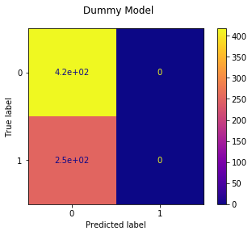
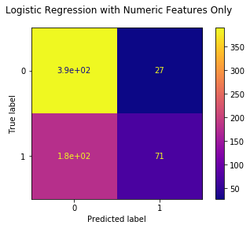
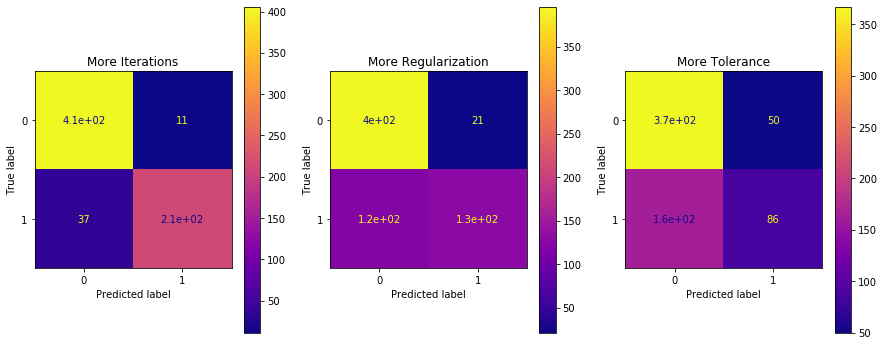
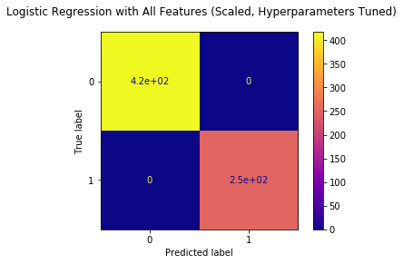
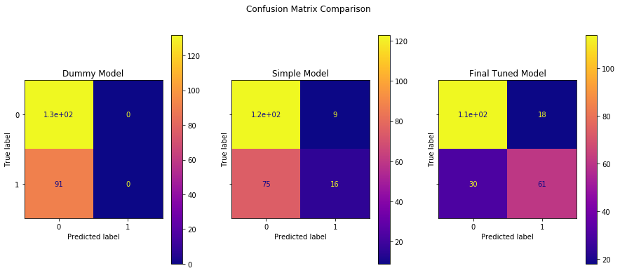

# Modeling Walkthrough


```python
! conda list scikit-learn
```

    # packages in environment at /Users/ehoffman/.conda/envs/prework-labs:
    #
    # Name                    Version                   Build  Channel
    scikit-learn              0.22             py37h3dc85bc_1    conda-forge


```python
import pandas as pd
import numpy as np

import matplotlib.pyplot as plt
import seaborn as sns

from sklearn.preprocessing import OneHotEncoder, StandardScaler

from sklearn.impute import MissingIndicator, SimpleImputer

from sklearn.dummy import DummyClassifier
from sklearn.linear_model import LogisticRegression

from sklearn.model_selection import train_test_split, cross_val_score
from sklearn.feature_selection import SelectFromModel

# plot_confusion_matrix is a handy visual tool, added in the latest version of scikit-learn
# if you are running an older version, comment out this line and just use confusion_matrix
from sklearn.metrics import plot_confusion_matrix
from sklearn.metrics import confusion_matrix
```

## Modeling Steps

1. Build a model based on the [Titanic dataset](https://www.kaggle.com/c/titanic/data) that predicts whether a given person survived or not
2. Evaluate the performance of the model
3. Make changes in an attempt to improve the model
4. Demonstrate whether an improvement was made

## The Data

This dataset has the following columns:

| Variable | Definition | Key |
| -------- | ---------- | --- |
| survival | Survival | 0 = No, 1 = Yes |
| pclass | Ticket class | 1 = 1st, 2 = 2nd, 3 = 3rd |
| sex | Sex | |
| Age | Age in years | |
| sibsp | # of siblings / spouses aboard the Titanic | |
| parch | # of parents / children aboard the Titanic | |
| ticket | Ticket number | |
| fare | Passenger fare | |
| cabin | Cabin number | |
| embarked | Port of Embarkation | C = Cherbourg, Q = Queenstown, S = Southampton |

## Initial Data Understanding and Preparation

Open up the file, get everything into `X` features and `y` target variables, divided into train and test


```python
df = pd.read_csv("titanic.csv")
```


```python
df.head()
```


<div>
<style scoped>
    .dataframe tbody tr th:only-of-type {
        vertical-align: middle;
    }

    .dataframe tbody tr th {
        vertical-align: top;
    }

    .dataframe thead th {
        text-align: right;
    }
</style>
<table border="1" class="dataframe">
  <thead>
    <tr style="text-align: right;">
      <th></th>
      <th>PassengerId</th>
      <th>Survived</th>
      <th>Pclass</th>
      <th>Name</th>
      <th>Sex</th>
      <th>Age</th>
      <th>SibSp</th>
      <th>Parch</th>
      <th>Ticket</th>
      <th>Fare</th>
      <th>Cabin</th>
      <th>Embarked</th>
    </tr>
  </thead>
  <tbody>
    <tr>
      <th>0</th>
      <td>1</td>
      <td>0</td>
      <td>3</td>
      <td>Braund, Mr. Owen Harris</td>
      <td>male</td>
      <td>22.0</td>
      <td>1</td>
      <td>0</td>
      <td>A/5 21171</td>
      <td>7.2500</td>
      <td>NaN</td>
      <td>S</td>
    </tr>
    <tr>
      <th>1</th>
      <td>2</td>
      <td>1</td>
      <td>1</td>
      <td>Cumings, Mrs. John Bradley (Florence Briggs Th...</td>
      <td>female</td>
      <td>38.0</td>
      <td>1</td>
      <td>0</td>
      <td>PC 17599</td>
      <td>71.2833</td>
      <td>C85</td>
      <td>C</td>
    </tr>
    <tr>
      <th>2</th>
      <td>3</td>
      <td>1</td>
      <td>3</td>
      <td>Heikkinen, Miss. Laina</td>
      <td>female</td>
      <td>26.0</td>
      <td>0</td>
      <td>0</td>
      <td>STON/O2. 3101282</td>
      <td>7.9250</td>
      <td>NaN</td>
      <td>S</td>
    </tr>
    <tr>
      <th>3</th>
      <td>4</td>
      <td>1</td>
      <td>1</td>
      <td>Futrelle, Mrs. Jacques Heath (Lily May Peel)</td>
      <td>female</td>
      <td>35.0</td>
      <td>1</td>
      <td>0</td>
      <td>113803</td>
      <td>53.1000</td>
      <td>C123</td>
      <td>S</td>
    </tr>
    <tr>
      <th>4</th>
      <td>5</td>
      <td>0</td>
      <td>3</td>
      <td>Allen, Mr. William Henry</td>
      <td>male</td>
      <td>35.0</td>
      <td>0</td>
      <td>0</td>
      <td>373450</td>
      <td>8.0500</td>
      <td>NaN</td>
      <td>S</td>
    </tr>
  </tbody>
</table>
</div>


```python
df.describe()
```


<div>
<style scoped>
    .dataframe tbody tr th:only-of-type {
        vertical-align: middle;
    }

    .dataframe tbody tr th {
        vertical-align: top;
    }

    .dataframe thead th {
        text-align: right;
    }
</style>
<table border="1" class="dataframe">
  <thead>
    <tr style="text-align: right;">
      <th></th>
      <th>PassengerId</th>
      <th>Survived</th>
      <th>Pclass</th>
      <th>Age</th>
      <th>SibSp</th>
      <th>Parch</th>
      <th>Fare</th>
    </tr>
  </thead>
  <tbody>
    <tr>
      <th>count</th>
      <td>891.000000</td>
      <td>891.000000</td>
      <td>891.000000</td>
      <td>714.000000</td>
      <td>891.000000</td>
      <td>891.000000</td>
      <td>891.000000</td>
    </tr>
    <tr>
      <th>mean</th>
      <td>446.000000</td>
      <td>0.383838</td>
      <td>2.308642</td>
      <td>29.699118</td>
      <td>0.523008</td>
      <td>0.381594</td>
      <td>32.204208</td>
    </tr>
    <tr>
      <th>std</th>
      <td>257.353842</td>
      <td>0.486592</td>
      <td>0.836071</td>
      <td>14.526497</td>
      <td>1.102743</td>
      <td>0.806057</td>
      <td>49.693429</td>
    </tr>
    <tr>
      <th>min</th>
      <td>1.000000</td>
      <td>0.000000</td>
      <td>1.000000</td>
      <td>0.420000</td>
      <td>0.000000</td>
      <td>0.000000</td>
      <td>0.000000</td>
    </tr>
    <tr>
      <th>25%</th>
      <td>223.500000</td>
      <td>0.000000</td>
      <td>2.000000</td>
      <td>20.125000</td>
      <td>0.000000</td>
      <td>0.000000</td>
      <td>7.910400</td>
    </tr>
    <tr>
      <th>50%</th>
      <td>446.000000</td>
      <td>0.000000</td>
      <td>3.000000</td>
      <td>28.000000</td>
      <td>0.000000</td>
      <td>0.000000</td>
      <td>14.454200</td>
    </tr>
    <tr>
      <th>75%</th>
      <td>668.500000</td>
      <td>1.000000</td>
      <td>3.000000</td>
      <td>38.000000</td>
      <td>1.000000</td>
      <td>0.000000</td>
      <td>31.000000</td>
    </tr>
    <tr>
      <th>max</th>
      <td>891.000000</td>
      <td>1.000000</td>
      <td>3.000000</td>
      <td>80.000000</td>
      <td>8.000000</td>
      <td>6.000000</td>
      <td>512.329200</td>
    </tr>
  </tbody>
</table>
</div>


Age data is missing for about 1 in 9 rows in our dataset.  For now, let's just exclude it, plus the non-numeric columns, and `PassengerId` which doesn't seem like a real feature, but rather just an artifact of the dataset.


```python
df = df.drop("PassengerId", axis=1)
```


```python
# Pclass are numbers but it's not clear that the difference between 1st and 2nd is the
# same as the difference between 2nd and 3rd
numeric_columns = ["Survived", "SibSp", "Parch", "Fare"]
```


```python
sns.pairplot(df[numeric_columns]);
```





```python
numeric_df = df[numeric_columns]
X = numeric_df.drop("Survived", axis=1)
y = numeric_df["Survived"]
X_train, X_test, y_train, y_test = train_test_split(X, y, random_state=2020)
```

## Modeling

Let's start with a completely "dummy" model, that will always choose the majority class.


```python
dummy_model = DummyClassifier(strategy="most_frequent")
```

Fit the model on our data


```python
dummy_model.fit(X_train, y_train)
```


    DummyClassifier(constant=None, random_state=None, strategy='most_frequent')


We should expect all predictions to be the same


```python
# just grabbing the first 50 to save space
dummy_model.predict(X_train)[:50]
```


    array([0, 0, 0, 0, 0, 0, 0, 0, 0, 0, 0, 0, 0, 0, 0, 0, 0, 0, 0, 0, 0, 0,
           0, 0, 0, 0, 0, 0, 0, 0, 0, 0, 0, 0, 0, 0, 0, 0, 0, 0, 0, 0, 0, 0,
           0, 0, 0, 0, 0, 0])


## Model Evaluation


```python
cross_val_score(dummy_model, X_train, y_train, cv=3)
```


    array([0.62331839, 0.62331839, 0.62612613])


So, the mean accuracy is a little over 62% if we always guess the majority class


```python
fig, ax = plt.subplots()

fig.suptitle("Dummy Model")

plot_confusion_matrix(dummy_model, X_train, y_train, ax=ax, cmap="plasma");
```





```python
# just the numbers (this should work even with older scikit-learn)
confusion_matrix(y_train, dummy_model.predict(X_train))
```


    array([[417,   0],
           [251,   0]])


A pretty lopsided confusion matrix!

## Modeling, Again

Let's use a logistic regression and compare its performance


```python
simple_logreg_model = LogisticRegression(random_state=2020)
```


```python
simple_logreg_model.fit(X_train, y_train)
```


    LogisticRegression(C=1.0, class_weight=None, dual=False, fit_intercept=True,
                       intercept_scaling=1, l1_ratio=None, max_iter=100,
                       multi_class='auto', n_jobs=None, penalty='l2',
                       random_state=2020, solver='lbfgs', tol=0.0001, verbose=0,
                       warm_start=False)


Look at the predictions


```python
simple_logreg_model.predict(X_train)[:50]
```


    array([0, 0, 0, 0, 0, 0, 0, 0, 0, 1, 0, 0, 0, 0, 0, 0, 0, 0, 0, 0, 0, 0,
           0, 0, 0, 1, 1, 0, 0, 0, 0, 0, 0, 0, 0, 0, 1, 0, 0, 0, 0, 0, 0, 0,
           0, 0, 0, 0, 0, 0])


Mixture of 1s and 0s this time

## Model Evaluation, Again


```python
cross_val_score(simple_logreg_model, X_train, y_train, cv=3)
```


    array([0.68161435, 0.69955157, 0.67567568])


So the mean accuracy is closer to 70% if the model is actually taking in information from the features instead of always guessing the majority class


```python
fig, ax = plt.subplots()

fig.suptitle("Logistic Regression with Numeric Features Only")

plot_confusion_matrix(simple_logreg_model, X_train, y_train, ax=ax, cmap="plasma");
```





```python
confusion_matrix(y_train, simple_logreg_model.predict(X_train))
```


    array([[390,  27],
           [180,  71]])


So, in general we are not labeling many of the "not survived" passengers as "survived", but for "survived" passengers we're getting it right only about half of the time

## Data Preparation, Again

Maybe there is some useful information in the features we are not using yet.  Let's go wild and add all of them!

Note: you can and should add features incrementally in a "real" modeling context.  The engineering effort of encoding the variables can be non-trivial!  But here let's assume that it's not too much work to encode all of them.

Start with a new train-test split that contains all of the features


```python
X = df.drop("Survived", axis=1)
y = df["Survived"]
X_train, X_test, y_train, y_test = train_test_split(X, y, random_state=2020)
```


```python
X_train.columns
```


    Index(['Pclass', 'Name', 'Sex', 'Age', 'SibSp', 'Parch', 'Ticket', 'Fare',
           'Cabin', 'Embarked'],
          dtype='object')


```python
X_train.isna().sum()
```


    Pclass        0
    Name          0
    Sex           0
    Age         123
    SibSp         0
    Parch         0
    Ticket        0
    Fare          0
    Cabin       516
    Embarked      2
    dtype: int64


### Handling Missing Values

Let's be extra cautious and make a separate column to indicate whether there originally was a missing value

In our training data there are only missing values for a couple of the columns, but we can't be sure about where the test set will be missing data


```python
indicator = MissingIndicator(features="all")
indicator.fit(X_train)
```


    MissingIndicator(error_on_new=True, features='all', missing_values=nan,
                     sparse='auto')


```python
def add_missing_indicator_columns(X, indicator):
    """
    Helper function for transforming features
    
    For every feature in X, create another feature indicating whether that feature
    is missing.  This doubles the number of columns in X.
    """
    
    # create a 2D array of True and False values indicating whether a given feature
    # is missing for that row
    missing_array_bool = indicator.transform(X)
    
    # transform into 1 and 0 for modeling
    missing_array_int = missing_array_bool.astype(int)
    
    # helpful for readability but not needed for modeling
    missing_column_names = [col + "_missing" for col in X.columns]
    
    # convert to df so it we can concat with X
    missing_df = pd.DataFrame(missing_array_int, columns=missing_column_names, index=X.index)
    
    return pd.concat([X, missing_df], axis=1)
```


```python
X_train = add_missing_indicator_columns(X_train, indicator)
```


```python
X_train.head()
```


<div>
<style scoped>
    .dataframe tbody tr th:only-of-type {
        vertical-align: middle;
    }

    .dataframe tbody tr th {
        vertical-align: top;
    }

    .dataframe thead th {
        text-align: right;
    }
</style>
<table border="1" class="dataframe">
  <thead>
    <tr style="text-align: right;">
      <th></th>
      <th>Pclass</th>
      <th>Name</th>
      <th>Sex</th>
      <th>Age</th>
      <th>SibSp</th>
      <th>Parch</th>
      <th>Ticket</th>
      <th>Fare</th>
      <th>Cabin</th>
      <th>Embarked</th>
      <th>Pclass_missing</th>
      <th>Name_missing</th>
      <th>Sex_missing</th>
      <th>Age_missing</th>
      <th>SibSp_missing</th>
      <th>Parch_missing</th>
      <th>Ticket_missing</th>
      <th>Fare_missing</th>
      <th>Cabin_missing</th>
      <th>Embarked_missing</th>
    </tr>
  </thead>
  <tbody>
    <tr>
      <th>620</th>
      <td>3</td>
      <td>Yasbeck, Mr. Antoni</td>
      <td>male</td>
      <td>27.0</td>
      <td>1</td>
      <td>0</td>
      <td>2659</td>
      <td>14.4542</td>
      <td>NaN</td>
      <td>C</td>
      <td>0</td>
      <td>0</td>
      <td>0</td>
      <td>0</td>
      <td>0</td>
      <td>0</td>
      <td>0</td>
      <td>0</td>
      <td>1</td>
      <td>0</td>
    </tr>
    <tr>
      <th>359</th>
      <td>3</td>
      <td>Mockler, Miss. Helen Mary "Ellie"</td>
      <td>female</td>
      <td>NaN</td>
      <td>0</td>
      <td>0</td>
      <td>330980</td>
      <td>7.8792</td>
      <td>NaN</td>
      <td>Q</td>
      <td>0</td>
      <td>0</td>
      <td>0</td>
      <td>1</td>
      <td>0</td>
      <td>0</td>
      <td>0</td>
      <td>0</td>
      <td>1</td>
      <td>0</td>
    </tr>
    <tr>
      <th>512</th>
      <td>1</td>
      <td>McGough, Mr. James Robert</td>
      <td>male</td>
      <td>36.0</td>
      <td>0</td>
      <td>0</td>
      <td>PC 17473</td>
      <td>26.2875</td>
      <td>E25</td>
      <td>S</td>
      <td>0</td>
      <td>0</td>
      <td>0</td>
      <td>0</td>
      <td>0</td>
      <td>0</td>
      <td>0</td>
      <td>0</td>
      <td>0</td>
      <td>0</td>
    </tr>
    <tr>
      <th>738</th>
      <td>3</td>
      <td>Ivanoff, Mr. Kanio</td>
      <td>male</td>
      <td>NaN</td>
      <td>0</td>
      <td>0</td>
      <td>349201</td>
      <td>7.8958</td>
      <td>NaN</td>
      <td>S</td>
      <td>0</td>
      <td>0</td>
      <td>0</td>
      <td>1</td>
      <td>0</td>
      <td>0</td>
      <td>0</td>
      <td>0</td>
      <td>1</td>
      <td>0</td>
    </tr>
    <tr>
      <th>420</th>
      <td>3</td>
      <td>Gheorgheff, Mr. Stanio</td>
      <td>male</td>
      <td>NaN</td>
      <td>0</td>
      <td>0</td>
      <td>349254</td>
      <td>7.8958</td>
      <td>NaN</td>
      <td>C</td>
      <td>0</td>
      <td>0</td>
      <td>0</td>
      <td>1</td>
      <td>0</td>
      <td>0</td>
      <td>0</td>
      <td>0</td>
      <td>1</td>
      <td>0</td>
    </tr>
  </tbody>
</table>
</div>


Now that we've specified which values were originally missing, let's fill in those missing values.  This takes two separate imputers because we want to use the mean for numeric data and the majority class for categorical data.


```python
numeric_feature_names = ["Age", "SibSp", "Parch", "Fare"]
categorical_feature_names = ["Pclass", "Name", "Sex", "Ticket", "Cabin", "Embarked"]

X_train_numeric = X_train[numeric_feature_names]
X_train_categorical = X_train[categorical_feature_names]
```


```python
numeric_imputer = SimpleImputer()
numeric_imputer.fit(X_train_numeric)
```


    SimpleImputer(add_indicator=False, copy=True, fill_value=None,
                  missing_values=nan, strategy='mean', verbose=0)


```python
categorical_imputer = SimpleImputer(strategy="most_frequent")
categorical_imputer.fit(X_train_categorical)
```


    SimpleImputer(add_indicator=False, copy=True, fill_value=None,
                  missing_values=nan, strategy='most_frequent', verbose=0)


```python
def impute_missing_values(X, imputer):
    """
    Given a DataFrame and an imputer, use the imputer to fill in all
    missing values in the DataFrame
    """
    imputed_array = imputer.transform(X)
    imputed_df = pd.DataFrame(imputed_array, columns=X.columns, index=X.index)
    return imputed_df
```


```python
X_train_numeric = impute_missing_values(X_train_numeric, numeric_imputer)
X_train_categorical = impute_missing_values(X_train_categorical, categorical_imputer)
```

Double-check to make sure that all of the missing values are gone:


```python
X_train_imputed = pd.concat([X_train_numeric, X_train_categorical], axis=1)
X_train_imputed.isna().sum()
```


    Age         0
    SibSp       0
    Parch       0
    Fare        0
    Pclass      0
    Name        0
    Sex         0
    Ticket      0
    Cabin       0
    Embarked    0
    dtype: int64


Drop all of the old columns from X_train, then concat the new imputed ones


```python
X_train = X_train.drop(numeric_feature_names + categorical_feature_names, axis=1)
X_train = pd.concat([X_train_imputed, X_train], axis=1)
```


```python
X_train.head()
```


<div>
<style scoped>
    .dataframe tbody tr th:only-of-type {
        vertical-align: middle;
    }

    .dataframe tbody tr th {
        vertical-align: top;
    }

    .dataframe thead th {
        text-align: right;
    }
</style>
<table border="1" class="dataframe">
  <thead>
    <tr style="text-align: right;">
      <th></th>
      <th>Age</th>
      <th>SibSp</th>
      <th>Parch</th>
      <th>Fare</th>
      <th>Pclass</th>
      <th>Name</th>
      <th>Sex</th>
      <th>Ticket</th>
      <th>Cabin</th>
      <th>Embarked</th>
      <th>Pclass_missing</th>
      <th>Name_missing</th>
      <th>Sex_missing</th>
      <th>Age_missing</th>
      <th>SibSp_missing</th>
      <th>Parch_missing</th>
      <th>Ticket_missing</th>
      <th>Fare_missing</th>
      <th>Cabin_missing</th>
      <th>Embarked_missing</th>
    </tr>
  </thead>
  <tbody>
    <tr>
      <th>620</th>
      <td>27.000000</td>
      <td>1.0</td>
      <td>0.0</td>
      <td>14.4542</td>
      <td>3</td>
      <td>Yasbeck, Mr. Antoni</td>
      <td>male</td>
      <td>2659</td>
      <td>B96 B98</td>
      <td>C</td>
      <td>0</td>
      <td>0</td>
      <td>0</td>
      <td>0</td>
      <td>0</td>
      <td>0</td>
      <td>0</td>
      <td>0</td>
      <td>1</td>
      <td>0</td>
    </tr>
    <tr>
      <th>359</th>
      <td>29.927982</td>
      <td>0.0</td>
      <td>0.0</td>
      <td>7.8792</td>
      <td>3</td>
      <td>Mockler, Miss. Helen Mary "Ellie"</td>
      <td>female</td>
      <td>330980</td>
      <td>B96 B98</td>
      <td>Q</td>
      <td>0</td>
      <td>0</td>
      <td>0</td>
      <td>1</td>
      <td>0</td>
      <td>0</td>
      <td>0</td>
      <td>0</td>
      <td>1</td>
      <td>0</td>
    </tr>
    <tr>
      <th>512</th>
      <td>36.000000</td>
      <td>0.0</td>
      <td>0.0</td>
      <td>26.2875</td>
      <td>1</td>
      <td>McGough, Mr. James Robert</td>
      <td>male</td>
      <td>PC 17473</td>
      <td>E25</td>
      <td>S</td>
      <td>0</td>
      <td>0</td>
      <td>0</td>
      <td>0</td>
      <td>0</td>
      <td>0</td>
      <td>0</td>
      <td>0</td>
      <td>0</td>
      <td>0</td>
    </tr>
    <tr>
      <th>738</th>
      <td>29.927982</td>
      <td>0.0</td>
      <td>0.0</td>
      <td>7.8958</td>
      <td>3</td>
      <td>Ivanoff, Mr. Kanio</td>
      <td>male</td>
      <td>349201</td>
      <td>B96 B98</td>
      <td>S</td>
      <td>0</td>
      <td>0</td>
      <td>0</td>
      <td>1</td>
      <td>0</td>
      <td>0</td>
      <td>0</td>
      <td>0</td>
      <td>1</td>
      <td>0</td>
    </tr>
    <tr>
      <th>420</th>
      <td>29.927982</td>
      <td>0.0</td>
      <td>0.0</td>
      <td>7.8958</td>
      <td>3</td>
      <td>Gheorgheff, Mr. Stanio</td>
      <td>male</td>
      <td>349254</td>
      <td>B96 B98</td>
      <td>C</td>
      <td>0</td>
      <td>0</td>
      <td>0</td>
      <td>1</td>
      <td>0</td>
      <td>0</td>
      <td>0</td>
      <td>0</td>
      <td>1</td>
      <td>0</td>
    </tr>
  </tbody>
</table>
</div>


```python
X_train.isna().sum()
```


    Age                 0
    SibSp               0
    Parch               0
    Fare                0
    Pclass              0
    Name                0
    Sex                 0
    Ticket              0
    Cabin               0
    Embarked            0
    Pclass_missing      0
    Name_missing        0
    Sex_missing         0
    Age_missing         0
    SibSp_missing       0
    Parch_missing       0
    Ticket_missing      0
    Fare_missing        0
    Cabin_missing       0
    Embarked_missing    0
    dtype: int64


### One-Hot Encoding

Now that there are no missing values, convert all of the categorical features into numbers.


```python
def encode_and_concat_feature_train(X_train, feature_name):
    """
    Helper function for transforming training data.  It takes in the full X dataframe and
    feature name, makes a one-hot encoder, and returns the encoder as well as the dataframe
    with that feature transformed into multiple columns of 1s and 0s
    """
    # make a one-hot encoder and fit it to the training data
    ohe = OneHotEncoder(categories="auto", handle_unknown="ignore")
    single_feature_df = X_train[[feature_name]]
    ohe.fit(single_feature_df)
    
    # call helper function that actually encodes the feature and concats it
    X_train = encode_and_concat_feature(X_train, feature_name, ohe)
    
    return ohe, X_train
```


```python
def encode_and_concat_feature(X, feature_name, ohe):
    """
    Helper function for transforming a feature into multiple columns of 1s and 0s. Used
    in both training and testing steps.  Takes in the full X dataframe, feature name, 
    and encoder, and returns the dataframe with that feature transformed into multiple
    columns of 1s and 0s
    """
    # create new one-hot encoded df based on the feature
    single_feature_df = X[[feature_name]]
    feature_array = ohe.transform(single_feature_df).toarray()
    ohe_df = pd.DataFrame(feature_array, columns=ohe.categories_[0], index=X.index)
    
    # drop the old feature from X and concat the new one-hot encoded df
    X = X.drop(feature_name, axis=1)
    X = pd.concat([X, ohe_df], axis=1)
    
    return X
```


```python
encoders = {}

for categorical_feature in categorical_feature_names:
    ohe, X_train = encode_and_concat_feature_train(X_train, categorical_feature)
    encoders[categorical_feature] = ohe
```


```python
X_train.head()
```


<div>
<style scoped>
    .dataframe tbody tr th:only-of-type {
        vertical-align: middle;
    }

    .dataframe tbody tr th {
        vertical-align: top;
    }

    .dataframe thead th {
        text-align: right;
    }
</style>
<table border="1" class="dataframe">
  <thead>
    <tr style="text-align: right;">
      <th></th>
      <th>Age</th>
      <th>SibSp</th>
      <th>Parch</th>
      <th>Fare</th>
      <th>Pclass_missing</th>
      <th>Name_missing</th>
      <th>Sex_missing</th>
      <th>Age_missing</th>
      <th>SibSp_missing</th>
      <th>Parch_missing</th>
      <th>...</th>
      <th>F G73</th>
      <th>F2</th>
      <th>F33</th>
      <th>F38</th>
      <th>F4</th>
      <th>G6</th>
      <th>T</th>
      <th>C</th>
      <th>Q</th>
      <th>S</th>
    </tr>
  </thead>
  <tbody>
    <tr>
      <th>620</th>
      <td>27.000000</td>
      <td>1.0</td>
      <td>0.0</td>
      <td>14.4542</td>
      <td>0</td>
      <td>0</td>
      <td>0</td>
      <td>0</td>
      <td>0</td>
      <td>0</td>
      <td>...</td>
      <td>0.0</td>
      <td>0.0</td>
      <td>0.0</td>
      <td>0.0</td>
      <td>0.0</td>
      <td>0.0</td>
      <td>0.0</td>
      <td>1.0</td>
      <td>0.0</td>
      <td>0.0</td>
    </tr>
    <tr>
      <th>359</th>
      <td>29.927982</td>
      <td>0.0</td>
      <td>0.0</td>
      <td>7.8792</td>
      <td>0</td>
      <td>0</td>
      <td>0</td>
      <td>1</td>
      <td>0</td>
      <td>0</td>
      <td>...</td>
      <td>0.0</td>
      <td>0.0</td>
      <td>0.0</td>
      <td>0.0</td>
      <td>0.0</td>
      <td>0.0</td>
      <td>0.0</td>
      <td>0.0</td>
      <td>1.0</td>
      <td>0.0</td>
    </tr>
    <tr>
      <th>512</th>
      <td>36.000000</td>
      <td>0.0</td>
      <td>0.0</td>
      <td>26.2875</td>
      <td>0</td>
      <td>0</td>
      <td>0</td>
      <td>0</td>
      <td>0</td>
      <td>0</td>
      <td>...</td>
      <td>0.0</td>
      <td>0.0</td>
      <td>0.0</td>
      <td>0.0</td>
      <td>0.0</td>
      <td>0.0</td>
      <td>0.0</td>
      <td>0.0</td>
      <td>0.0</td>
      <td>1.0</td>
    </tr>
    <tr>
      <th>738</th>
      <td>29.927982</td>
      <td>0.0</td>
      <td>0.0</td>
      <td>7.8958</td>
      <td>0</td>
      <td>0</td>
      <td>0</td>
      <td>1</td>
      <td>0</td>
      <td>0</td>
      <td>...</td>
      <td>0.0</td>
      <td>0.0</td>
      <td>0.0</td>
      <td>0.0</td>
      <td>0.0</td>
      <td>0.0</td>
      <td>0.0</td>
      <td>0.0</td>
      <td>0.0</td>
      <td>1.0</td>
    </tr>
    <tr>
      <th>420</th>
      <td>29.927982</td>
      <td>0.0</td>
      <td>0.0</td>
      <td>7.8958</td>
      <td>0</td>
      <td>0</td>
      <td>0</td>
      <td>1</td>
      <td>0</td>
      <td>0</td>
      <td>...</td>
      <td>0.0</td>
      <td>0.0</td>
      <td>0.0</td>
      <td>0.0</td>
      <td>0.0</td>
      <td>0.0</td>
      <td>0.0</td>
      <td>1.0</td>
      <td>0.0</td>
      <td>0.0</td>
    </tr>
  </tbody>
</table>
<p>5 rows × 1345 columns</p>
</div>


```python
X_train.shape
```


    (668, 1345)


This is...a ridiculous number of columns.  How did we end up with more columns than rows?

(Answer: each unique name and ticket number is now its own column)

## Modeling, Again

Let's run a logistic regression on our ridiculous number of columns


```python
logreg_model = LogisticRegression(random_state=2020)
logreg_model.fit(X_train, y_train)
```

    /Users/ehoffman/.conda/envs/prework-labs/lib/python3.7/site-packages/sklearn/linear_model/_logistic.py:939: ConvergenceWarning: lbfgs failed to converge (status=1):
    STOP: TOTAL NO. of ITERATIONS REACHED LIMIT.
    
    Increase the number of iterations (max_iter) or scale the data as shown in:
        https://scikit-learn.org/stable/modules/preprocessing.html.
    Please also refer to the documentation for alternative solver options:
        https://scikit-learn.org/stable/modules/linear_model.html#logistic-regression
      extra_warning_msg=_LOGISTIC_SOLVER_CONVERGENCE_MSG)


    LogisticRegression(C=1.0, class_weight=None, dual=False, fit_intercept=True,
                       intercept_scaling=1, l1_ratio=None, max_iter=100,
                       multi_class='auto', n_jobs=None, penalty='l2',
                       random_state=2020, solver='lbfgs', tol=0.0001, verbose=0,
                       warm_start=False)


What happened there?  This solver had no problem before

Answer: it wasn't able to find the minimum with this number of steps in gradient descent

Let's try a couple of stopgap measures to get the model to run


```python
logreg_model_more_iterations = LogisticRegression(random_state=2020, max_iter=1000)
logreg_model_more_iterations.fit(X_train, y_train)
```


    LogisticRegression(C=1.0, class_weight=None, dual=False, fit_intercept=True,
                       intercept_scaling=1, l1_ratio=None, max_iter=1000,
                       multi_class='auto', n_jobs=None, penalty='l2',
                       random_state=2020, solver='lbfgs', tol=0.0001, verbose=0,
                       warm_start=False)


```python
logreg_model_more_regularization = LogisticRegression(random_state=2020, C=0.01)
logreg_model_more_regularization.fit(X_train, y_train)
```


    LogisticRegression(C=0.01, class_weight=None, dual=False, fit_intercept=True,
                       intercept_scaling=1, l1_ratio=None, max_iter=100,
                       multi_class='auto', n_jobs=None, penalty='l2',
                       random_state=2020, solver='lbfgs', tol=0.0001, verbose=0,
                       warm_start=False)


```python
logreg_model_higher_tolerance = LogisticRegression(random_state=2020, tol=100)
logreg_model_higher_tolerance.fit(X_train, y_train)
```


    LogisticRegression(C=1.0, class_weight=None, dual=False, fit_intercept=True,
                       intercept_scaling=1, l1_ratio=None, max_iter=100,
                       multi_class='auto', n_jobs=None, penalty='l2',
                       random_state=2020, solver='lbfgs', tol=100, verbose=0,
                       warm_start=False)


## Model Evaluation, Again


```python
fix, axes = plt.subplots(nrows=1, ncols=3, figsize=(15, 6))

axes[0].set_title("More Iterations")
axes[1].set_title("More Regularization")
axes[2].set_title("More Tolerance")

plot_confusion_matrix(logreg_model_more_iterations, X_train, y_train, ax=axes[0], cmap="plasma")
plot_confusion_matrix(logreg_model_more_regularization, X_train, y_train, ax=axes[1], cmap="plasma")
plot_confusion_matrix(logreg_model_higher_tolerance, X_train, y_train, ax=axes[2], cmap="plasma");
```





```python
print(cross_val_score(logreg_model_more_iterations, X_train, y_train, cv=3))
print(cross_val_score(logreg_model_more_regularization, X_train, y_train, cv=3))
print(cross_val_score(logreg_model_higher_tolerance, X_train, y_train, cv=3))
```

    [0.78475336 0.84304933 0.81081081]
    [0.74887892 0.75336323 0.74324324]
    [0.69058296 0.67713004 0.66216216]


## Data Preparation, Again

Let's scale all of the features, so the model isn't overly penalizing age and fare


```python
scaler = StandardScaler()

scaler.fit(X_train)
```


    StandardScaler(copy=True, with_mean=True, with_std=True)


```python
def scale_values(X, scaler):
    """
    Given a DataFrame and a fitted scaler, use the scaler to scale all of the features
    """
    scaled_array = scaler.transform(X)
    scaled_df = pd.DataFrame(scaled_array, columns=X.columns, index=X.index)
    return scaled_df
```


```python
X_train = scale_values(X_train, scaler)
```


```python
X_train.head()
```


<div>
<style scoped>
    .dataframe tbody tr th:only-of-type {
        vertical-align: middle;
    }

    .dataframe tbody tr th {
        vertical-align: top;
    }

    .dataframe thead th {
        text-align: right;
    }
</style>
<table border="1" class="dataframe">
  <thead>
    <tr style="text-align: right;">
      <th></th>
      <th>Age</th>
      <th>SibSp</th>
      <th>Parch</th>
      <th>Fare</th>
      <th>Pclass_missing</th>
      <th>Name_missing</th>
      <th>Sex_missing</th>
      <th>Age_missing</th>
      <th>SibSp_missing</th>
      <th>Parch_missing</th>
      <th>...</th>
      <th>F G73</th>
      <th>F2</th>
      <th>F33</th>
      <th>F38</th>
      <th>F4</th>
      <th>G6</th>
      <th>T</th>
      <th>C</th>
      <th>Q</th>
      <th>S</th>
    </tr>
  </thead>
  <tbody>
    <tr>
      <th>620</th>
      <td>-2.197037e-01</td>
      <td>0.445769</td>
      <td>-0.488105</td>
      <td>-0.367749</td>
      <td>0.0</td>
      <td>0.0</td>
      <td>0.0</td>
      <td>-0.475066</td>
      <td>0.0</td>
      <td>0.0</td>
      <td>...</td>
      <td>-0.0548</td>
      <td>-0.0548</td>
      <td>-0.03872</td>
      <td>-0.03872</td>
      <td>-0.03872</td>
      <td>-0.067166</td>
      <td>-0.03872</td>
      <td>2.074027</td>
      <td>-0.299537</td>
      <td>-1.640307</td>
    </tr>
    <tr>
      <th>359</th>
      <td>-2.665810e-16</td>
      <td>-0.473285</td>
      <td>-0.488105</td>
      <td>-0.501995</td>
      <td>0.0</td>
      <td>0.0</td>
      <td>0.0</td>
      <td>2.104969</td>
      <td>0.0</td>
      <td>0.0</td>
      <td>...</td>
      <td>-0.0548</td>
      <td>-0.0548</td>
      <td>-0.03872</td>
      <td>-0.03872</td>
      <td>-0.03872</td>
      <td>-0.067166</td>
      <td>-0.03872</td>
      <td>-0.482154</td>
      <td>3.338481</td>
      <td>-1.640307</td>
    </tr>
    <tr>
      <th>512</th>
      <td>4.556193e-01</td>
      <td>-0.473285</td>
      <td>-0.488105</td>
      <td>-0.126142</td>
      <td>0.0</td>
      <td>0.0</td>
      <td>0.0</td>
      <td>-0.475066</td>
      <td>0.0</td>
      <td>0.0</td>
      <td>...</td>
      <td>-0.0548</td>
      <td>-0.0548</td>
      <td>-0.03872</td>
      <td>-0.03872</td>
      <td>-0.03872</td>
      <td>-0.067166</td>
      <td>-0.03872</td>
      <td>-0.482154</td>
      <td>-0.299537</td>
      <td>0.609642</td>
    </tr>
    <tr>
      <th>738</th>
      <td>-2.665810e-16</td>
      <td>-0.473285</td>
      <td>-0.488105</td>
      <td>-0.501656</td>
      <td>0.0</td>
      <td>0.0</td>
      <td>0.0</td>
      <td>2.104969</td>
      <td>0.0</td>
      <td>0.0</td>
      <td>...</td>
      <td>-0.0548</td>
      <td>-0.0548</td>
      <td>-0.03872</td>
      <td>-0.03872</td>
      <td>-0.03872</td>
      <td>-0.067166</td>
      <td>-0.03872</td>
      <td>-0.482154</td>
      <td>-0.299537</td>
      <td>0.609642</td>
    </tr>
    <tr>
      <th>420</th>
      <td>-2.665810e-16</td>
      <td>-0.473285</td>
      <td>-0.488105</td>
      <td>-0.501656</td>
      <td>0.0</td>
      <td>0.0</td>
      <td>0.0</td>
      <td>2.104969</td>
      <td>0.0</td>
      <td>0.0</td>
      <td>...</td>
      <td>-0.0548</td>
      <td>-0.0548</td>
      <td>-0.03872</td>
      <td>-0.03872</td>
      <td>-0.03872</td>
      <td>-0.067166</td>
      <td>-0.03872</td>
      <td>2.074027</td>
      <td>-0.299537</td>
      <td>-1.640307</td>
    </tr>
  </tbody>
</table>
<p>5 rows × 1345 columns</p>
</div>


## Modeling, Again

Now that the data is scaled, let's see if we can fit the model without tweaking any hyperparameters


```python
logreg_model = LogisticRegression(random_state=2020)
logreg_model.fit(X_train, y_train)
```


    LogisticRegression(C=1.0, class_weight=None, dual=False, fit_intercept=True,
                       intercept_scaling=1, l1_ratio=None, max_iter=100,
                       multi_class='auto', n_jobs=None, penalty='l2',
                       random_state=2020, solver='lbfgs', tol=0.0001, verbose=0,
                       warm_start=False)


## Model Evaluation, Again

Now that we are able to run a logistic regression with default hyperparameters, let's see how that performs


```python
fig, ax = plt.subplots()

fig.suptitle("Logistic Regression with All Features, Scaled")

plot_confusion_matrix(logreg_model, X_train, y_train, ax=ax, cmap="plasma");
```


```python
all_features_cross_val_score = cross_val_score(logreg_model, X_train, y_train, cv=3)
all_features_cross_val_score
```


    array([0.76681614, 0.78026906, 0.76576577])


Perfect on the training data, high 70% range on the test data...this might be overfitting


```python
sorted(list(zip(X_train.columns, logreg_model.coef_[0])), key=lambda x: abs(x[1]), reverse=True)[:50]
```


    [('male', -0.7643948972144892),
     ('female', 0.764394897214489),
     (3, -0.38422693193447643),
     ('Cabin_missing', -0.3106443704109745),
     ('B96 B98', -0.28210405736415356),
     (1, 0.28200801726585256),
     ('Allison, Master. Hudson Trevor', 0.27079097245621253),
     ('1601', 0.242204243328471),
     ('Asplund, Master. Edvin Rojj Felix', 0.23363908872795028),
     ('Goldsmith, Master. Frank John William "Frankie"', 0.23296410078178317),
     ('Davies, Master. John Morgan Jr', 0.23058437142549115),
     ('Fare', 0.22844987001239384),
     ('Age', -0.22581470391094952),
     ('Foo, Mr. Choong', 0.22331777223687646),
     ('Bing, Mr. Lee', 0.21403931451919828),
     ('Chip, Mr. Chang', 0.2140393145191982),
     ('Allison, Miss. Helen Loraine', -0.21342729393489526),
     ('Mallet, Master. Andre', 0.2085563609109029),
     ('29106', 0.2056675183772136),
     ('347082', -0.20327783745510944),
     ('Allison, Mrs. Hudson J C (Bessie Waldo Daniels)', -0.20074651588208078),
     ('Navratil, Master. Edmond Roger', 0.19647537938215226),
     ('113760', 0.19140984711508005),
     ('Thorneycroft, Mrs. Percival (Florence Kate White)', 0.1895525994946325),
     ('Backstrom, Mrs. Karl Alfred (Maria Mathilda Gustafsson)',
      0.18887452475196576),
     ('Nakid, Mr. Sahid', 0.18307223572165873),
     ('2653', 0.18251562679909836),
     ('O\'Brien, Mrs. Thomas (Johanna "Hannah" Godfrey)', 0.182221678912626),
     ('Hakkarainen, Mrs. Pekka Pietari (Elin Matilda Dolck)', 0.18158679160006927),
     ('Johannesen-Bratthammer, Mr. Bernt', 0.1808216675846795),
     ('65306', 0.1808216675846795),
     ('Dahl, Mr. Karl Edwart', 0.1797363112810958),
     ('7598', 0.1797363112810958),
     ('347077', 0.17868621520150965),
     ('Niskanen, Mr. Juha', 0.1779740946645599),
     ('STON/O 2. 3101289', 0.1779740946645599),
     ('Jonsson, Mr. Carl', 0.1759142442260328),
     ('350417', 0.1759142442260328),
     ('Jussila, Mr. Eiriik', 0.17590849635772762),
     ('STON/O 2. 3101286', 0.17590849635772762),
     ('Stranden, Mr. Juho', 0.17561360557474057),
     ('STON/O 2. 3101288', 0.17561360557474057),
     ('McCoy, Mr. Bernard', 0.17530347291086648),
     ('367226', 0.17530347291086648),
     ('Persson, Mr. Ernst Ulrik', 0.17527460903426034),
     ('347083', 0.17527460903426034),
     ('2666', 0.17518720915323635),
     ('Sheerlinck, Mr. Jan Baptist', 0.17489617445466069),
     ('345779', 0.17489617445466069),
     ('Hedman, Mr. Oskar Arvid', 0.1745115972254716)]


## Hyperparameter Tuning

Let's try out some different regularization penalties to see if we can improve the test data score a bit


```python
logreg_model = LogisticRegression(random_state=2020, C=0.1)
logreg_model.fit(X_train, y_train)

print("Old:", all_features_cross_val_score)
print("New:", cross_val_score(logreg_model, X_train, y_train, cv=3))
```

    Old: [0.76681614 0.78026906 0.76576577]
    New: [0.76233184 0.76681614 0.75675676]


Seems like it doesn't make a difference

Try a little less regularization:


```python
logreg_model = LogisticRegression(random_state=2020, C=0.5)
logreg_model.fit(X_train, y_train)

print("Old:", all_features_cross_val_score)
print("New:", cross_val_score(logreg_model, X_train, y_train, cv=3))
```

    Old: [0.76681614 0.78026906 0.76576577]
    New: [0.76233184 0.77578475 0.76576577]


Same or worse

Try a little more regularization:


```python
logreg_model = LogisticRegression(random_state=2020, C=0.05)
logreg_model.fit(X_train, y_train)

print("Old:", all_features_cross_val_score)
print("New:", cross_val_score(logreg_model, X_train, y_train, cv=3))
```

    Old: [0.76681614 0.78026906 0.76576577]
    New: [0.75784753 0.77130045 0.74774775]


Also worse.  It looks like the default C value is pretty optimal for this solver.

Let's try some other solvers


```python
logreg_model = LogisticRegression(random_state=2020, solver="liblinear")
logreg_model.fit(X_train, y_train)

print("Old:", all_features_cross_val_score)
print("New:", cross_val_score(logreg_model, X_train, y_train, cv=3))
```

    Old: [0.76681614 0.78026906 0.76576577]
    New: [0.78026906 0.78026906 0.77027027]


A little slower, but no major difference in the scores.  Let's try adding some more regularization


```python
logreg_model = LogisticRegression(random_state=2020, solver="liblinear", C=0.01)
logreg_model.fit(X_train, y_train)

print("Old:", all_features_cross_val_score)
print("New:", cross_val_score(logreg_model, X_train, y_train, cv=3))
```

    Old: [0.76681614 0.78026906 0.76576577]
    New: [0.78026906 0.78475336 0.76126126]


Getting better.  Try a different type of penalty:


```python
logreg_model = LogisticRegression(random_state=2020, solver="liblinear", penalty="l1")
logreg_model.fit(X_train, y_train)

print("Old:", all_features_cross_val_score)
print("New:", cross_val_score(logreg_model, X_train, y_train, cv=3))
```

    Old: [0.76681614 0.78026906 0.76576577]
    New: [0.77130045 0.82511211 0.7972973 ]


Slightly better average here.  Try adding some more regularization with L1 penalty:


```python
logreg_model = LogisticRegression(random_state=2020, solver="liblinear", penalty="l1", C=0.01)
logreg_model.fit(X_train, y_train)

print("Old:", all_features_cross_val_score)
print("New:", cross_val_score(logreg_model, X_train, y_train, cv=3))
```

    Old: [0.76681614 0.78026906 0.76576577]
    New: [0.76681614 0.8206278  0.7972973 ]


Still, the default regularization strength seems pretty good.  Double-check the confusion matrix:


```python
logreg_model = LogisticRegression(random_state=2020, solver="liblinear", penalty="l1")
logreg_model.fit(X_train, y_train)

fig, ax = plt.subplots()

fig.suptitle("Logistic Regression with All Features (Scaled, Hyperparameters Tuned)")

plot_confusion_matrix(logreg_model, X_train, y_train, ax=ax, cmap="plasma");
```





Probably still overfitting, but let's call this our final model!

## Final Model Evaluation

Now that we have a final model, run X_test through all of the preprocessing steps so we can evaluate the model's performance


```python
X_test_no_transformations = X_test.copy()
```


```python
# add missing indicators
X_test = add_missing_indicator_columns(X_test, indicator)
```


```python
# separate out values for imputation
X_test_numeric = X_test[numeric_feature_names]
X_test_categorical = X_test[categorical_feature_names]
```


```python
# impute missing values
X_test_numeric = impute_missing_values(X_test_numeric, numeric_imputer)
X_test_categorical = impute_missing_values(X_test_categorical, categorical_imputer)
X_test_imputed = pd.concat([X_test_numeric, X_test_categorical], axis=1)
X_test = X_test.drop(numeric_feature_names + categorical_feature_names, axis=1)
X_test = pd.concat([X_test_imputed, X_test], axis=1)
```


```python
# one-hot encode categorical data
for categorical_feature in categorical_feature_names:
    X_test = encode_and_concat_feature(X_test, categorical_feature, encoders[categorical_feature])
```


```python
# scale values
X_test = scale_values(X_test, scaler)
```

Create a model with the relevant hyperparameters, fit, and score


```python
final_model = LogisticRegression(random_state=2020, solver="liblinear", penalty="l1")
final_model.fit(X_train, y_train)

final_model.score(X_test, y_test)
```


    0.7847533632286996


```python
final_scores_dict = {
    "Mean Accuracy": [
        dummy_model.score(X_test, y_test), 
        simple_logreg_model.score(X_test_no_transformations[["SibSp", "Parch", "Fare"]], y_test),
        final_model.score(X_test, y_test)
    ]
}
final_scores_df = pd.DataFrame(final_scores_dict, index=["Dummy Model", "Simple Logistic Regression Model", "Final Model"])
final_scores_df
```


<div>
<style scoped>
    .dataframe tbody tr th:only-of-type {
        vertical-align: middle;
    }

    .dataframe tbody tr th {
        vertical-align: top;
    }

    .dataframe thead th {
        text-align: right;
    }
</style>
<table border="1" class="dataframe">
  <thead>
    <tr style="text-align: right;">
      <th></th>
      <th>Mean Accuracy</th>
    </tr>
  </thead>
  <tbody>
    <tr>
      <th>Dummy Model</th>
      <td>0.591928</td>
    </tr>
    <tr>
      <th>Simple Logistic Regression Model</th>
      <td>0.623318</td>
    </tr>
    <tr>
      <th>Final Model</th>
      <td>0.784753</td>
    </tr>
  </tbody>
</table>
</div>


Final comparison of confusion matrices


```python
fig, axes = plt.subplots(nrows=1, ncols=3, figsize=(15, 6), sharey=True)

fig.suptitle("Confusion Matrix Comparison")

axes[0].set_title("Dummy Model")
axes[1].set_title("Simple Model")
axes[2].set_title("Final Tuned Model")

plot_confusion_matrix(dummy_model, X_test, y_test, ax=axes[0], cmap="plasma")
plot_confusion_matrix(simple_logreg_model, X_test_no_transformations[["SibSp", "Parch", "Fare"]], y_test, ax=axes[1], cmap="plasma")
plot_confusion_matrix(final_model, X_test, y_test, ax=axes[2], cmap="plasma");
```





```python
y.value_counts(normalize=True)
```


    0    0.616162
    1    0.383838
    Name: Survived, dtype: float64


## Referencing this Repository

Some elements of this repository are intentionally designed to represent what not to do.  Here's an overview distinguishing which elements those are

### What to Do

 - Use a dummy model to understand the baseline, then FSM to understand what kind of performance you can get with minimal engineering work
    - The dummy model mainly matters for class imbalance.  If you have a perfectly balanced set of targets, then the intuitive "50% accuracy = coin flip" assumption works.  But if it's imbalanced, or you're using a metric other than accuracy, it's nice to have a placeholder model to understand your model's performance against
    - Usually FSM means that you use all numeric features that don't have any missing values, with a simple model like a logistic regression or a decision tree.  You could also just pick one numeric feature if you want.  The goal is to understand how much improvement you've gotten with your additional engineering work
 - Fit preprocessors on train, transform train and test with the same preprocessor
    - Use a `MissingIndicator` + `SimpleImputer` for the most robust handling of missing data.  Could just use a `SimpleImputer` if you don't think a value being missing is relevant information
    - Do NOT just drop rows with missing values
 - Use train-test split, cross-validation to choose a best model, evaluate test data at the end
    - It's useful to have confusion matrices to visualize what the model is getting wrong, but it's important that you choose a model based on the cross-validated score, not the confusion matrix.  Otherwise you risk choosing something that is overfit to the training data and won't actually have the best performance
    - When you are out of time (or seeing diminishing returns), choose a final model and evaluate it at the end (optionally compared to dummy and/or FSM)

### What not to Do

 - "Dumping" all features into the model without actual EDA
    - A single `sns.pairplot` is not sufficient EDA to understand what the features actually are, and whether it makes sense to include them in the model
    - Using a unique identifier (e.g. name, ticket number) as a feature --> causes overfitting because the model can just "memorize" the identifiers associated with the outcomes, rather than "learning" the relationships between the true features and the outcomes
 - Logistic regression without scaling
    - Anything distance-based should use scaling!  Otherwise the model is looking at the actual magnitude of the feature values (e.g. 1000 dollars), rather than their relative magnitude (1000 dollars in terms of GDP, home price, car price, shoe price, etc.)
    - Logistic regression uses regularization, which is distance-based.  Similarly kNN is distance based in terms of finding the "nearest".  Tree-based models (e.g. decision tree, random forest) are not distance-based.
 - Use hyperparameter tuning to try to overcome issues with feature selection/preprocessing
    - This happened first when we forgot to scale the data --> the model fit produced a big warning message
       - If you don't scale the data (in some cases), you'll get a warning message about the solver failing to converge.  This means that the gradient descent ran out of steps and failed to find a minimum (with the specified tolerance)
       - It is possible to make the warning go away by adding more steps, or increasing the tolerance --> these are both hyperparameters of the model related to gradient descent
       - But in the case shown here, the actual problem was that the data hadn't been scaled, nothing to do with the model hyperparameters.  When we scaled the data, the "vanilla" model fit just fine.
    - This happened second when we noticed that the model was overfitting --> the performance on the training data was 100%, performance on the test data was around 76%
       - The code in this notebook used different regularization strategies to try to handle this (solver, penalty, type of regularization, etc. --> all hyperparameters related to regularization)
       - In general, regularization is a good approach to overfitting, and it did end up helping a bit.  But the _actual_ problem causing the overfitting was never addressed, because the actual problem was that we were using names as features, so the model was "memorizing" aspects of the training data that would never be available in the test data.
       - While regularization still might be helpful, the best next step would be to remove the unique identifiers from the set of features, not just to adjust the regularization like we did
    - Overall, hyperparameter tuning is an important part of the overall modeling process.  However it will only get you marginal model improvement; you'll usually see much better gains by understanding your features better, adding more intentional feature engineering, and potentially pulling in additional features from additional data sources


```python

```
